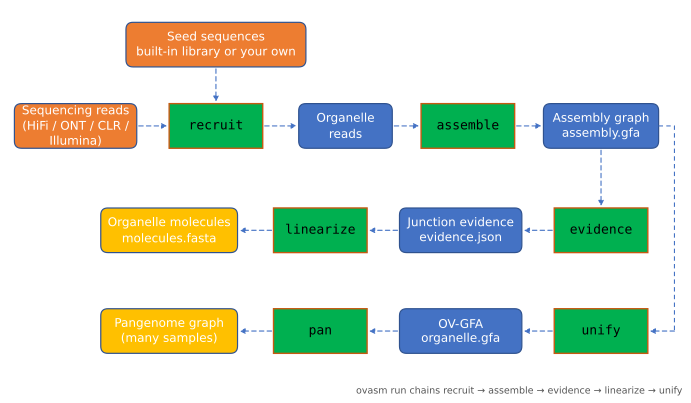
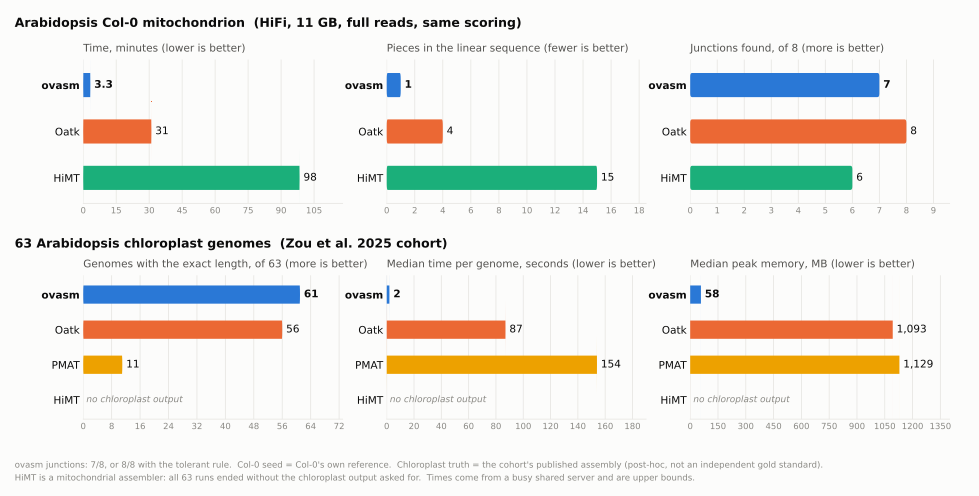

# ovasm

**Assemble plant mitochondrial and chloroplast genomes from sequencing reads — and get the evidence, not just one sequence.**

[English](README.md) | [简体中文](README.zh-CN.md) | [Wiki](https://github.com/forageseed/ovasm/wiki)

Part of [OrganelleVerse](https://github.com/forageseed/organelleverse).

<p align="center"></p>

## Why ovasm

- **One pass over the raw reads.** Organelle reads are picked out once; everything after that works on that small set.
- **An assembly graph with evidence, not just a sequence.** Every junction comes with the number of reads that support it, and `molecules.fasta` holds the representative molecule(s). When the reads cannot tell structures apart, `decisive` is `false` instead of a silent guess.
- **One program, no setup.** No conda, no containers, no system libraries (gzip is pure Rust), and a built-in seed library, so no reference file is needed either. Tested on Linux and Windows.
- **Pangenome-ready.** The graph is also written as OV-GFA, which `ovasm pan` merges across samples.

## Install

ovasm is built from source with Rust 1.80 or newer; there are no pre-built binaries yet. Three steps on every system:
install Rust, build, and make sure the `ovasm` program is on your `PATH`. `cargo install` does the last two together.

<details open>
<summary><b>Linux</b> (tested)</summary>

```bash
# 1. Rust (skip if `cargo --version` already works); needs a C compiler such as gcc
curl --proto '=https' --tlsv1.2 -sSf https://sh.rustup.rs | sh

# 2. Build and install into ~/.cargo/bin
git clone https://github.com/forageseed/ovasm.git
cd ovasm
cargo install --path .

# 3. Check (open a new shell first if the command is not found)
ovasm --version
```

rustup puts `~/.cargo/bin` on your `PATH` for new shells. To put the program somewhere else:

```bash
cargo build --release
install -m 755 target/release/ovasm ~/.local/bin/                 # a folder on your PATH
echo 'export PATH="$HOME/.local/bin:$PATH"' >> ~/.bashrc           # only if that folder is not on it yet
cp target/release/ovasm "$CONDA_PREFIX/bin/"                       # or into the active conda environment
```
</details>

<details>
<summary><b>macOS</b> (not tested by us)</summary>

```bash
xcode-select --install                                              # C toolchain
curl --proto '=https' --tlsv1.2 -sSf https://sh.rustup.rs | sh      # Rust

git clone https://github.com/forageseed/ovasm.git
cd ovasm
cargo install --path .                                              # installs to ~/.cargo/bin
ovasm --version
```

Open a new terminal after installing Rust so that `~/.cargo/bin` is on your `PATH`. To use another folder, copy
`target/release/ovasm` there and add the folder to `PATH` in `~/.zshrc`:
`export PATH="$HOME/tools:$PATH"`.
</details>

<details>
<summary><b>Windows</b> (PowerShell; tested)</summary>

1. Install Rust from <https://rustup.rs> (`rustup-init.exe`, default MSVC toolchain). If asked, install the
   Microsoft C++ Build Tools (workload "Desktop development with C++").
2. Build and install:

```powershell
git clone https://github.com/forageseed/ovasm.git
cd ovasm
cargo install --path .        # installs %USERPROFILE%\.cargo\bin\ovasm.exe, which rustup already put on PATH
ovasm --version               # in a new PowerShell window
```

To keep the program in a folder of your own, copy `target\release\ovasm.exe` there and add the folder to your user
`PATH`, then open a new window:

```powershell
[Environment]::SetEnvironmentVariable("Path", "C:\Tools\ovasm;" + [Environment]::GetEnvironmentVariable("Path", "User"), "User")
```
</details>

Update with `cargo install --path . --force` after `git pull`; remove with `cargo uninstall ovasm`.

**With OrganelleVerse.** OrganelleVerse finds `ovasm` on your `PATH`. If it is somewhere else, point to it:

```bash
export ORG_VERSE_OVASM_BIN=$HOME/.cargo/bin/ovasm          # Linux / macOS: put this line in ~/.bashrc or ~/.zshrc
```
```powershell
[Environment]::SetEnvironmentVariable("ORG_VERSE_OVASM_BIN", "$env:USERPROFILE\.cargo\bin\ovasm.exe", "User")   # Windows
```

## Use

You need whole-genome reads: HiFi, or Illumina with `--read-type sr`. No reference file is needed:

```bash
ovasm run --reads sample.hifi.fastq.gz --organelle both --out out/ --threads 8
```

ovasm uses its built-in land-plant seed library (`seeddb/`, 16 mitochondrial and 44 plastid genomes, including
*Arabidopsis thaliana*; compiled into the program) to pick out the organelle reads, and writes the seeds it used to
`out/seeds/`. To use a close relative of your own instead, give it per organelle; whatever you leave out still comes
from the library:

```bash
ovasm run --reads sample.hifi.fastq.gz --organelle both \
  --seeds mitochondrion=mt_reference.fasta --seeds plastid=pt_reference.fasta --out out/ --threads 8
```

Results are written to `out/mitochondrion/` and `out/plastid/` (for one organelle, `--organelle mitochondrion` or
`plastid` writes straight into `out/`):

| File | Content |
|---|---|
| `assembly.gfa` | assembly graph; segments carry depth |
| `evidence.json` | reads supporting every link and branch; which segments are repeats |
| `molecules.fasta` | the representative molecule(s), unfolded along read-supported paths |
| `linearization.json` | how that representative was chosen and whether the reads can decide (`decisive`) |
| `organelle.gfa` | the graph as OV-GFA, ready for `ovasm pan` |
| `summary.json` | run summary: k used, `k_accepted`, molecule lengths, links, files |

Check `summary.json` (`k_accepted`, `decisive`) before trusting a result.

The library holds a handful of species per lineage, so a distant species may recruit few reads; then give a closer
reference with `--seeds`. `--recruit discover` needs no seeds at all: it finds organelle reads by k-mer depth (HiFi
only). It needs the organelle reads to stand out from the nuclear background and can fail; `--recruit both` combines
the seeds with it. Because *Arabidopsis thaliana* is in the library, a run on Arabidopsis is seeded with its own
genome and is not a blind test.

## How it works

1. **Recruit.** The raw reads are read once. Reads that share k-mers with the seed genomes (or, without seeds, reads
   that are far deeper than the nuclear genome) are kept; the rest is never looked at again.
2. **Assemble.** The organelle reads are turned into a sparse de Bruijn graph over closed syncmers. The k is chosen
   automatically, and ovasm retries with a smaller k until the molecules explain at least half of the graph.
3. **Count the evidence.** For every link, branch and repeat pairing in the graph, ovasm counts the reads that
   support it.
4. **Unfold.** Representative molecules are traced along read-supported paths. ovasm says whether the reads single
   one structure out (`decisive`), because plant mitochondria usually exist in several forms at once.
5. **Export.** The graph is rewritten as OV-GFA (blunt links, PanSN paths) so that many samples can be merged into
   a pangenome with `ovasm pan`.

What sets it apart: it returns the **graph and its evidence**, not just one sequence; it **tells you when the reads
cannot decide**; `--mode standard` assembles downsampled replicates and reports, for every junction, the share of
replicates that reproduce it; it takes **HiFi, ONT (with self-correction), CLR and Illumina** reads; and it is
**one program**.

## Compared with other tools

<p align="center"></p>

| | ovasm | Oatk | HiMT | PMAT |
|---|---|---|---|---|
| Success (63 chloroplasts) | 63/63 | 63/63 | 0/63, see note | 62/63 |
| Accuracy (Col-0 mitochondrion) | complete circle, 100% | 99.0% in 4 pieces | 99.8% in 15 pieces | not run |
| Time (Col-0, full reads) | about 3 min | 31 min | 98 min | – |
| Memory (63 chloroplasts, median) | 58 MB | 1,093 MB | 297 MB | 1,129 MB |
| Platforms | one program; built and tested on Linux and Windows | conda environment | conda environment | container |

All numbers were measured by us on the data named in the figure; per-sample tables are on the
[wiki](https://github.com/forageseed/ovasm/wiki/Benchmarks). Read them with these limits in mind:

- **ovasm is not shown to be better across species.** In four rounds of frozen blind tests on new species
  (pre-registered thresholds, identity at least 0.9999, 12 tasks each: mitochondrion and chloroplast of 6 species),
  ovasm passed 3/12, 6/12, 8/12 and 7/12; the first round (3 species) passed 2/6. The other tools were not scored
  under the same thresholds on those species, so there is no head-to-head blind comparison. Fixes made while looking
  at those data raise the replays (for example 10/12 on one round), but replays are not blind tests. The figure uses
  data we had already seen.
- **Col-0 mitochondrion:** the seed was Col-0's own reference genome, which makes recruitment easy; it affects which
  reads are recruited, not how the graph is built. When Oatk and HiMT were given the 150x reads that ovasm recruited,
  both found 8/8 junctions in 42 s and 84 s (plus about 200 s of recruitment); Oatk then gave 3 pieces and HiMT 14.
- **Chloroplast cohort:** the "truth" is the cohort's own published assembly, not an independent gold standard, and it
  was a post-hoc comparison. HiMT is a mitochondrial assembler: its 63 runs failed because it did not produce the
  chloroplast output we asked for, which says nothing about its quality. ovasm failed on 2 samples at its first k and
  was fixed by retrying with a smaller k, a rule that is now built into `ovasm run`.
- **Time and memory:** times were measured on a busy shared server, so read them as upper bounds. ovasm's time is mostly
  the single pass over the raw reads. It peaks at 229 MB for recruitment on Col-0 and stays under 170 MB for the later
  steps; the heaviest steps are seed-free `discover` (6.9 GB) and hybrid correction of ONT reads (2.3 GB).
- **Platforms:** on Windows the program builds in 93 s (17 MB), its 141 tests pass, and a full run on the example reads
  takes 5 s. macOS has not been tested.

## Commands

`ovasm run` chains the stages below; each is also a command (`ovasm <command> --help`).

| Command | Does |
|---|---|
| `run` | the whole pipeline: recruit, assemble, evidence, linearize, unify |
| `recruit` | pick organelle reads out of whole-genome data using seeds |
| `discover` | find organelle reads without seeds, by k-mer depth |
| `panel` | say which organelle a set of reads comes from, by conserved proteins |
| `correct` | self-correct noisy long reads (ONT, CLR) |
| `assemble` | build the assembly graph |
| `evidence` | count read support for every link of a graph |
| `linearize` | pick the representative sequence(s) |
| `unify` | rewrite a graph as OV-GFA |
| `pan` | merge OV-GFA graphs of several samples into one pangenome graph |
| `components` | keep only the connected parts that are the target organelle |
| `identify` | find the closest reference genomes of an assembly |
| `label` | label graph pieces mitochondrion or plastid by gene content |

## Status

Tested on gold-standard genomes (Nipponbare, *Arabidopsis thaliana* Col-0, *Salvia miltiorrhiza*). Testing across
more species is still in progress, so treat results on a new species as something to check.

## Use from OrganelleVerse

```python
ov.assembly.assemble(data, organelle="mitochondrion", method="ovasm")
```

OrganelleVerse finds the program through the `ORG_VERSE_OVASM_BIN` environment variable, or on your `PATH`
(see [Install](#install)).

## License

MIT
