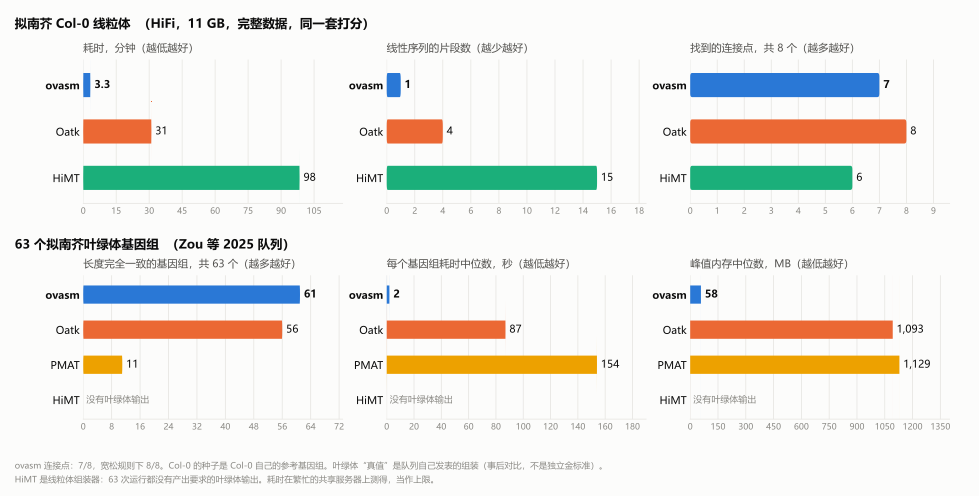

# ovasm

**用测序数据组装植物线粒体和叶绿体基因组，给出的不只是一条序列，还有证据。**

[English](README.md) | [简体中文](README.zh-CN.md) | [Wiki](https://github.com/forageseed/ovasm/wiki/zh-Home)

[OrganelleVerse](https://github.com/forageseed/organelleverse) 的一部分。

<p align="center"></p>

## 为什么用 ovasm

- **原始数据只扫一遍。** 一次挑出细胞器 reads，之后的计算都在这一小份数据上做。
- **输出带证据的组装图，而不只是序列。** 每个连接点都有支持它的 reads 数；`molecules.fasta` 是代表分子。
  reads 分不出结构时，`decisive` 会写 `false`，不会悄悄猜一个。
- **一个程序，不用配环境。** 不需要 conda、容器或系统库（gzip 是纯 Rust 实现），还内置了种子库，
  连参考文件都不用准备。在 Linux 和 Windows 上测试过。
- **直接可用于泛基因组。** 图同时写成 OV-GFA，`ovasm pan` 可以把多个样本合并。

## 安装

ovasm 用 Rust（1.80 或更高版本）从源码编译，暂时没有预编译的程序。三个系统的步骤一样：
装 Rust、编译、确保 `ovasm` 程序在 `PATH` 里。`cargo install` 一步完成后两件事。

<details open>
<summary><b>Linux</b>（已测试）</summary>

```bash
# 1. 装 Rust（如果 `cargo --version` 已经能用就跳过）；需要 gcc 之类的 C 编译器
curl --proto '=https' --tlsv1.2 -sSf https://sh.rustup.rs | sh

# 2. 编译并安装到 ~/.cargo/bin
git clone https://github.com/forageseed/ovasm.git
cd ovasm
cargo install --path .

# 3. 检查（找不到命令的话先开一个新的终端）
ovasm --version
```

rustup 会让新开的终端把 `~/.cargo/bin` 放进 `PATH`。想把程序放到别处：

```bash
cargo build --release
install -m 755 target/release/ovasm ~/.local/bin/                 # PATH 里已有的文件夹
echo 'export PATH="$HOME/.local/bin:$PATH"' >> ~/.bashrc           # 仅当这个文件夹还不在 PATH 里
cp target/release/ovasm "$CONDA_PREFIX/bin/"                       # 或者放进当前的 conda 环境
```
</details>

<details>
<summary><b>macOS</b>（我们没有测试过）</summary>

```bash
xcode-select --install                                              # C 工具链
curl --proto '=https' --tlsv1.2 -sSf https://sh.rustup.rs | sh      # Rust

git clone https://github.com/forageseed/ovasm.git
cd ovasm
cargo install --path .                                              # 安装到 ~/.cargo/bin
ovasm --version
```

装完 Rust 后开一个新的终端，`~/.cargo/bin` 才会在 `PATH` 里。想用别的文件夹：把 `target/release/ovasm`
复制过去，再在 `~/.zshrc` 里把这个文件夹加进 `PATH`：`export PATH="$HOME/tools:$PATH"`。
</details>

<details>
<summary><b>Windows</b>（PowerShell；已测试）</summary>

1. 从 <https://rustup.rs> 安装 Rust（`rustup-init.exe`，默认 MSVC 工具链）。如果提示，
   就安装 Microsoft C++ 生成工具（工作负载选“使用 C++ 的桌面开发”）。
2. 编译并安装：

```powershell
git clone https://github.com/forageseed/ovasm.git
cd ovasm
cargo install --path .        # 安装为 %USERPROFILE%\.cargo\bin\ovasm.exe，rustup 已经把这个文件夹放进了 PATH
ovasm --version               # 在新开的 PowerShell 窗口里运行
```

想把程序放在自己的文件夹：把 `target\release\ovasm.exe` 复制过去，把该文件夹加进用户 `PATH`，再开一个新窗口：

```powershell
[Environment]::SetEnvironmentVariable("Path", "C:\Tools\ovasm;" + [Environment]::GetEnvironmentVariable("Path", "User"), "User")
```
</details>

`git pull` 之后用 `cargo install --path . --force` 更新；用 `cargo uninstall ovasm` 卸载。

**配合 OrganelleVerse 使用。** OrganelleVerse 会在 `PATH` 里找 `ovasm`。如果放在别处，就告诉它位置：

```bash
export ORG_VERSE_OVASM_BIN=$HOME/.cargo/bin/ovasm          # Linux / macOS：把这行写进 ~/.bashrc 或 ~/.zshrc
```
```powershell
[Environment]::SetEnvironmentVariable("ORG_VERSE_OVASM_BIN", "$env:USERPROFILE\.cargo\bin\ovasm.exe", "User")   # Windows
```

## 使用

需要全基因组测序数据：HiFi，或 Illumina（加 `--read-type sr`）。不需要提供任何参考序列：

```bash
ovasm run --reads sample.hifi.fastq.gz --organelle both --out out/ --threads 8
```

ovasm 用内置的陆生植物种子库（`seeddb/`，16 个线粒体和 44 个叶绿体基因组，包括拟南芥，已编进程序）
挑出细胞器 reads，并把用到的种子写到 `out/seeds/`。想改用你自己的近缘物种，按细胞器分别给；
没给的那个细胞器仍然用内置库：

```bash
ovasm run --reads sample.hifi.fastq.gz --organelle both \
  --seeds mitochondrion=mt_reference.fasta --seeds plastid=pt_reference.fasta --out out/ --threads 8
```

结果写在 `out/mitochondrion/` 和 `out/plastid/`（只拼一个细胞器时，`--organelle mitochondrion` 或
`plastid` 直接写进 `out/`）：

| 文件 | 内容 |
|---|---|
| `assembly.gfa` | 组装图，片段带深度 |
| `evidence.json` | 每个连接和分叉有多少 reads 支持；哪些片段是重复 |
| `molecules.fasta` | 代表分子，沿 reads 支持的路径解开得到 |
| `linearization.json` | 代表序列怎么选的，reads 能不能分出结构（`decisive`） |
| `organelle.gfa` | OV-GFA 格式的图，可直接给 `ovasm pan` |
| `summary.json` | 运行摘要：用的 k、`k_accepted`、分子长度、连接数、文件列表 |

用结果之前先看 `summary.json`（`k_accepted`、`decisive`）。

种子库每个类群只有少数几个物种，物种太远时可能招到的 reads 很少，这时用 `--seeds` 给一个更近的参考。
`--recruit discover` 完全不需要种子：按 k-mer 深度找细胞器 reads（只支持 HiFi），
要求细胞器 reads 的深度明显高于核背景，可能失败；`--recruit both` 把种子和它合在一起用。
因为种子库里有拟南芥，拿拟南芥做测试时种子就是它自己的基因组，不算盲测。

## 工作原理

1. **招募。** 原始数据只读一遍：与种子基因组共享 k-mer 的 reads（没有种子时，则是深度远高于核基因组的 reads）被留下，
   其余的之后不再看。
2. **组装。** 细胞器 reads 建成基于封闭 syncmer 的稀疏 de Bruijn 图。k 自动选择，分子不足以解释图的一半时换更小的 k 重试。
3. **统计证据。** 对图上的每个连接、分叉和重复配对，数出支持它的 reads。
4. **解环。** 沿着有 reads 支持的路径给出代表分子，并说明 reads 能不能确定唯一结构（`decisive`），
   因为植物线粒体常常同时以多种构型存在。
5. **导出。** 图被改写成 OV-GFA（平端连接、PanSN 路径），可用 `ovasm pan` 把多个样本合并成泛基因组。

特色：给出的是**图和它的证据**，而不只是一条序列；reads **分不出结构时会明说**；`--mode standard` 会组装降采样重复，
报告每个连接点被多少比例的重复复现；支持 **HiFi、ONT（带自纠错）、CLR 和 Illumina**；**只有一个程序**。

## 和现有工具比较

<p align="center"></p>

| | ovasm | Oatk | HiMT | PMAT |
|---|---|---|---|---|
| 成功率（63 个叶绿体） | 63/63 | 63/63 | 0/63，见说明 | 62/63 |
| 准确度（Col-0 线粒体） | 完整的环，100% | 99.0%，4 段 | 99.8%，15 段 | 未跑 |
| 耗时（Col-0，完整数据） | 约 3 分钟 | 31 分钟 | 98 分钟 | – |
| 内存（63 个叶绿体，中位数） | 58 MB | 1,093 MB | 297 MB | 1,129 MB |
| 平台 | 一个程序，在 Linux 和 Windows 上编译并测试过 | conda 环境 | conda 环境 | 容器 |

所有数字都是我们自己在图中所写的数据上测的；逐样本的表格见
[Wiki](https://github.com/forageseed/ovasm/wiki/zh-Benchmarks)。读的时候请记住这些限定：

- **没有证明 ovasm 在跨物种上更好。** 在四轮对新物种的冻结盲测里（阈值事先固定，一致率至少 0.9999，每轮 12 个任务：
  6 个物种的线粒体和叶绿体），ovasm 严格通过 3/12、6/12、8/12 和 7/12；第一轮（3 个物种）通过 2/6。
  这些物种上没有按同一门槛给其他工具打分，所以没有盲测的正面比较。看过这些数据之后做的修复会让回放通过更多
  （比如某一轮 10/12），但回放不是盲测。图里用的都是我们已经看过的数据。
- **Col-0 线粒体：** 种子用的是 Col-0 自己的参考基因组，这让招募变得容易；它影响的是招到哪些 reads，不是怎么建图。
  把 ovasm 招募出的 150 倍 reads 交给 Oatk 和 HiMT 时，两者都找到 8/8 个连接点，分别用 42 秒和 84 秒（另加约 200 秒招募），
  Oatk 给出 3 段，HiMT 14 段。
- **叶绿体队列：** “真值”是队列自己发表的组装，不是独立的金标准，而且是事后对比。HiMT 是线粒体组装器：
  63 次都失败是因为它没产出我们要的叶绿体输出，这不说明它的质量。ovasm 有 2 个样本在第一个 k 下失败，
  换更小的 k 重试后解决，这条规则现在已经内置在 `ovasm run` 里。
- **耗时和内存：** 耗时在繁忙的共享服务器上测得，请当作上限。ovasm 的时间主要花在对原始数据的那一遍扫描上。
  它在 Col-0 上招募阶段峰值 229 MB，之后的步骤都在 170 MB 以内；最费内存的是无种子的 `discover`（6.9 GB）
  和 ONT 的混合纠错（2.3 GB）。
- **平台：** 在 Windows 上，程序 93 秒编译完（17 MB），141 个测试全过，用示例 reads 完整跑一遍 5 秒。macOS 没测过。

## 命令

`ovasm run` 把下面这些阶段串起来；每个阶段也都是单独的命令（`ovasm <命令> --help`）。

| 命令 | 作用 |
|---|---|
| `run` | 完整流程：招募、组装、证据、解环、统一格式 |
| `recruit` | 用种子从全基因组数据里招募细胞器 reads |
| `discover` | 不用种子，按 k-mer 深度找细胞器 reads |
| `panel` | 按保守蛋白判断一份 reads 来自哪个细胞器 |
| `correct` | 含噪长读长（ONT、CLR）自纠错 |
| `assemble` | 建组装图 |
| `evidence` | 统计图上每个连接的 reads 支持 |
| `linearize` | 选出代表序列 |
| `unify` | 把图改写成 OV-GFA |
| `pan` | 把多个样本的 OV-GFA 合并成一个泛基因组图 |
| `components` | 只保留属于目标细胞器的连通部分 |
| `identify` | 找组装结果最接近的参考基因组 |
| `label` | 按基因组成给图的片段标注线粒体或质体 |

## 状态

已在金标准基因组（日本晴、拟南芥 Col-0、丹参）上测试。更多物种的测试仍在进行，
所以在新物种上的结果请先核对。

## 在 OrganelleVerse 里使用

```python
ov.assembly.assemble(data, organelle="mitochondrion", method="ovasm")
```

OrganelleVerse 通过环境变量 `ORG_VERSE_OVASM_BIN` 或 `PATH` 找到这个程序（见[安装](#安装)）。

## 许可证

MIT
